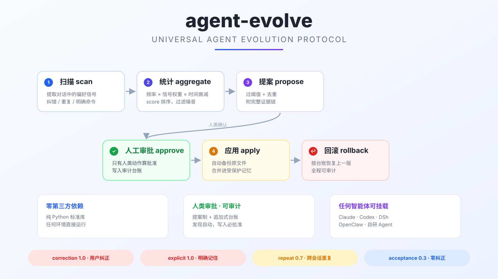

# agent-evolve



**Universal Agent Evolution Protocol** — 让任何智能体从对话中自动发现用户偏好，经人工审批后沉淀为长期记忆。

[](LICENSE)


一个零依赖、平台无关的开源工具：扫描对话历史 → 按频率与纠错模式统计信号 → 生成带证据链的提案 → 人工审批 → 备份应用 → 台账回滚。发现是自动的，写入永远需要人类批准。

## 它解决什么问题

1. **会话失忆**：智能体每次唤醒都从头开始，用户反复交代同样的偏好
2. **噪音沉淀**：单次提及就写入记忆，容易把临时要求当成长期规则
3. **黑箱学习**：要么不学，要么悄悄改自己，缺乏透明、可审计的机制

agent-evolve 用「频率 + 信号强度 + 时间衰减」过滤噪音，用「提案 + 审批 + 台账 + 回滚」保证透明可控。

## 核心不变量（安全红线）

1. 智能体永远不能自行批准自己的提案，批准必须来自人类
2. 受保护文件只能经提案流程修改，禁止直接编辑
3. 提案未批准前不产生任何持久效果
4. 工具运行失败等操作性事件永不作为学习素材
5. 每次批准写入台账，可回滚、可审计

## 快速开始

```bash
# 1. 初始化工作区
python3 -m evolve.cli init --root demo

# 2. 放入对话历史（.md / .txt / .jsonl），然后扫描
python3 -m evolve.cli scan --root demo

# 3. 生成提案（过阈值且未重复的主题）
python3 -m evolve.cli propose --root demo

# 4. 人工审批
python3 -m evolve.cli list --root demo
python3 -m evolve.cli approve evo-20260815-001 --root demo --approver alice

# 5. 应用（自动备份 + 合并进目标文件 + 台账）
python3 -m evolve.cli apply evo-20260815-001 --root demo

# 6. 反悔了？回滚
python3 -m evolve.cli rollback evo-20260815-001 --root demo
```

试用示例数据：

```bash
python3 -m evolve.cli scan --history examples/conversations
python3 -m evolve.cli propose --min-score 1.5
```

## CLI 命令

| 命令 | 作用 |
|------|------|
| `evolve init` | 初始化工作区目录结构与默认配置 |
| `evolve scan` | 扫描对话历史，输出信号统计（主题 × 信号类型 × 分数） |
| `evolve propose` | 为过阈值主题生成提案（含证据链，自动去重） |
| `evolve list` | 列出提案及其状态 |
| `evolve approve <id>` | 人工批准（写入台账） |
| `evolve reject <id>` | 拒绝提案（保留原因） |
| `evolve apply <id>` | 应用已批准提案：备份 → 合并 → 台账 |
| `evolve rollback <id>` | 从备份恢复，退回上一版本 |

## 工作原理

```
history/ 对话日志
   │  scan: 关键词命中 + 触发词分类（correction / explicit / repeat / acceptance）
   ▼
信号统计：score = Σ(次数 × 信号权重 × 时间衰减)
   │  propose: 过阈值 + 去重 → 提案（附证据链）
   ▼
proposals/pending/
   │  approve（人类）→ 台账
   ▼
apply: 备份 → 合并进受保护文件 → 台账
   │
   ▼
rollback: 从 backups/ 恢复
```

信号类型与权重：

| 信号 | 含义 | 权重 |
|------|------|------|
| correction | 用户主动纠正（"说了别用冒号"） | 1.0 |
| explicit | 用户明确要求记住（"以后都用表格"） | 1.0 |
| repeat | 跨会话重复提及 | 0.7 |
| acceptance | 采用且未被纠正（弱信号） | 0.3 |

时间衰减：近 30 天权重 1.0，之后每 30 天衰减一次，最低 0.2，防止陈旧偏好长期占位。

## 目录结构

```
universal-evolution/
├── evolve/                  # 核心包（零第三方依赖）
│   ├── cli.py               # 命令入口
│   └── core.py              # 扫描/统计/提案/审批/应用/回滚
├── rules/config.json        # 主题词表、阈值、学习档案、受保护文件
├── templates/proposal.md    # 提案模板
├── history/                 # 对话历史（用户自备）
├── proposals/pending/       # 待审批提案
├── backups/{proposal_id}/   # 应用前快照
├── ledger/approval.jsonl    # 追加式审计台账
└── examples/                # 示例对话与示例记忆
```

## 安装到你的智能体

核心工具一层通用，各平台加一个小适配文件即可：

| 平台 | 安装方式 | 入口文件 | 审批通道 |
|------|----------|----------|----------|
| Claude Code | `pip install agent-evolve` + Skill | `adapters/claude-code/SKILL.md`（放 `~/.claude/skills/agent-evolve/`） | 对话确认 + `evolve approve` |
| Codex CLI | `pip install agent-evolve` | `adapters/codex.md`（AGENTS.md 声明） | 对话确认 + `evolve approve` |
| DSh / DeepSeek Harness | `pip install agent-evolve` | `adapters/dsh.md`（skill 或规则文档） | 文件签名 / 用户监督 |
| OpenClaw | `pip install agent-evolve` | `adapters/openclaw.md`（cron + 会话） | 桌面卡片 / 对话确认 |
| 自研 Agent | `pip install agent-evolve` 或 import `evolve.core` | 直接调 CLI | 自定义 |

快速开始：

```bash
bash install.sh            # 或 bash install.sh --local
# 然后按 adapters/ 下对应平台的指南配置入口
```

详细适配说明见 [adapters/](adapters/) 目录与 [docs/architecture.md](docs/architecture.md)。

## 路线图

- **v0.1（当前）**：信号扫描 + 统计 + 提案 + CLI 审批 + 应用/回滚
- **v0.2**：规则细化模块（已有条目的 diff 合并与版本化）、embedding 语义匹配
- **v0.3**：平台适配器开箱（OpenClaw / Claude Code hook 脚本）、Web 审批 UI
- **v1.0**：硬写保护（宿主框架集成）、多用户权限、规则冲突检测

## 贡献

欢迎 PR。开发前请阅读 [docs/architecture.md](docs/architecture.md)，保持零第三方依赖与纯文件设计。提交信息请遵循 Conventional Commits。

## License

MIT © universal-evolution contributors
